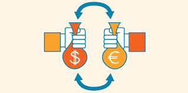

# Currency Conversion



This cash project allow you to convert an amount of a certain currency in other currencies. 

## Getting Started

These instructions will help you understand how set the project fine and how to run it on your local machine for development and testing purposes.


### Prerequisites

You need to have a terminal up and node.js installed on your computer.


### Installing

Here is what to do to have the project ready to work.

In the cash Folder:
```
npm install
```

This will install all the libraries that are needed for this project (specified in the 'package.json' file)


## Running the project

### Global overview of the project

To see some examples of how to run the code and have a global overview of the commands, run this command
```
node index.js
```


### Some example of useful commands

Set your favourites currencies to convert to 

```
node index.js --save eur usd aud pln
```

Convert an amount of currency 

```
node index.js 30 eur
```

Get the Help

```
node index.js --help
```

## Author of the workshop

* **Azzout Yassine** - *Initial work* - (https://github.com/92bondstreet)

## Contributor

* **Gaussens Jules** - ** - (https://github.com/jgaussens/)
